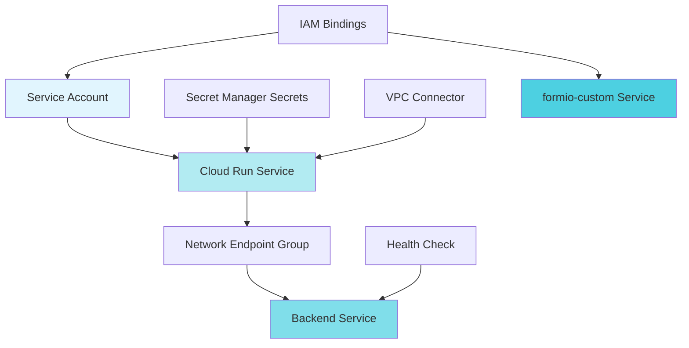
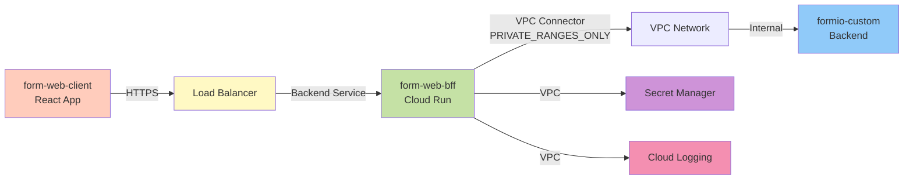

# PRD: form-web-bff Terraform Module

**Status:** Draft
**Author:** Claude AI (Architectural Analysis)
**Created:** 2025-11-06
**Version:** 1.0

---

## Executive Summary

### Problem Statement

The `form-web-bff-server` application currently exists as a standalone service with ad-hoc Terraform configuration in `apps/form-web-bff-server/terraform/`. This creates several problems:

1. **Inconsistent Infrastructure Patterns**: Does not follow dss-formio-service module conventions
2. **No VPC Integration**: Missing central infrastructure networking patterns
3. **No Secret Management**: Hardcoded configuration without Secret Manager
4. **No Load Balancer Integration**: Lacks NEG + Backend Service for production LB
5. **Testing Gaps**: No alignment with existing testing infrastructure
6. **Operational Complexity**: Separate deployment path from other form.io services

### Proposed Solution

Consolidate `form-web-bff-server` into a new Terraform module at `dss-formio-service/terraform/modules/form-web-bff/` that:

1. Follows existing `formio-custom-service` module patterns
2. Integrates with central VPC infrastructure (PRIVATE_RANGES_ONLY egress)
3. Uses Secret Manager for sensitive configuration
4. Provides NEG + Backend Service for load balancer integration
5. Implements least-privilege IAM with dedicated service account
6. Includes comprehensive testing aligned with existing infrastructure

### Success Criteria

- [x] Module passes `terraform validate`
- [x] Module passes `tflint` with zero warnings
- [x] Module passes `tfsec` (minimum severity: MEDIUM)
- [x] Integration tests deploy successfully to dev environment
- [x] Documentation complete and generated via `terraform-docs`
- [x] Code review approved by platform team
- [x] Successfully deployed and tested in dev environment

---

## Architectural Analysis

### Comparison: Current vs. Proposed

| Aspect | Current (Standalone) | Proposed (Module) |
|--------|---------------------|-------------------|
| **Location** | `apps/form-web-bff-server/terraform/` | `dss-formio-service/terraform/modules/form-web-bff/` |
| **Cloud Run Version** | v2 (correct) | v2 (maintain) |
| **Port Configuration** | Hardcoded 3002 | Configurable via ARG/ENV/variable |
| **VPC Networking** | None | PRIVATE_RANGES_ONLY egress via central infra |
| **Load Balancer** | None | NEG + Backend Service for LB integration |
| **Secret Management** | None | Secret Manager integration |
| **Service Account** | Default | Dedicated with least-privilege IAM |
| **IAM Roles** | None | secretAccessor, logWriter, metricWriter, cloudtrace.agent |
| **Health Checks** | Basic startup/liveness | Startup + Liveness on /health/ready, /health/live |
| **Labels** | Minimal | Comprehensive (cost-center, application-id, owner, etc.) |
| **Monitoring** | None | Alert policies for error rate, latency |
| **Backend Integration** | Direct URL | Service-to-service auth with formio-custom |

### Architectural Decisions

#### AD-1: VPC Egress Configuration

**Decision:** Use `PRIVATE_RANGES_ONLY` egress via central VPC connector

**Rationale:**
- Aligns with formio-custom-service pattern
- Security best practice (restricts outbound internet access)
- BFF only needs to communicate with:
  - formio-custom backend (internal)
  - Secret Manager (Google API via VPC)
  - Cloud Logging/Monitoring (Google API via VPC)

**Reference:**
```terraform
# From terraform/environments/dev/main.tf (line 246)
vpc_network_id   = data.terraform_remote_state.central_infra.outputs.vpc_network_id
egress_subnet_id = data.terraform_remote_state.central_infra.outputs.egress_subnet_id
```

**Trade-offs:**
- ✅ Improved security posture
- ✅ Compliance with zero-trust architecture
- ❌ Requires VPC connector (already exists in central infra)
- ❌ Slightly more complex troubleshooting

#### AD-2: Port Configuration Strategy

**Decision:** Make port configurable via Dockerfile ARG + ENV + Terraform variable

**Current State:** formio-custom-service hardcodes port 3001 in locals
```terraform
# From formio-custom-service/main.tf (line 64)
container_port = 3001
```

**Proposed:** Add variable for flexibility
```terraform
variable "container_port" {
  description = "Container port for BFF server"
  type        = number
  default     = 3002
  validation {
    condition     = var.container_port >= 1024 && var.container_port <= 65535
    error_message = "Container port must be between 1024 and 65535."
  }
}
```

**Rationale:**
- BFF uses port 3002 (different from formio-custom 3001)
- Future microservices may need different ports
- Dockerfile ARG allows build-time configuration
- Terraform variable allows environment-specific override

**Implementation:**
```dockerfile
# In form-web-bff-server/Dockerfile
ARG PORT=3002
ENV PORT=${PORT}
EXPOSE ${PORT}
```

#### AD-3: Service-to-Service Authentication

**Decision:** Use Google Cloud Run service-to-service authentication with JWT tokens

**Pattern:**
```typescript
// BFF server authenticates to formio-custom
const response = await fetch(formioCustomUrl, {
  headers: {
    'Authorization': `Bearer ${await getIdToken(formioCustomUrl)}`
  }
});
```

**Implementation:**
1. BFF service account granted `roles/run.invoker` on formio-custom
2. BFF uses metadata server to fetch ID token scoped to formio-custom URL
3. formio-custom validates token via Cloud Run's built-in authentication

**IAM Configuration:**
```terraform
# Grant BFF service account permission to invoke formio-custom
resource "google_cloud_run_service_iam_member" "bff_to_formio_custom" {
  location = var.region
  service  = var.formio_custom_service_name
  role     = "roles/run.invoker"
  member   = "serviceAccount:${google_service_account.form_web_bff.email}"
}
```

**Rationale:**
- Zero configuration (no API keys or secrets needed)
- Automatic token rotation
- Built-in Cloud Run feature
- Audit trail via Cloud Logging

#### AD-4: Secret Manager Integration

**Decision:** Reuse JWT secret from formio-custom, no additional secrets needed initially

**Existing Secrets (from formio-custom):**
```terraform
# From formio-custom-service/main.tf (lines 8-31)
data "google_secret_manager_secret_version" "mongodb_connection_string" { ... }
data "google_secret_manager_secret_version" "formio_jwt_secret" { ... }
data "google_secret_manager_secret_version" "formio_db_secret" { ... }
data "google_secret_manager_secret_version" "formio_root_password" { ... }
```

**BFF-Specific Secrets (if needed):**
```terraform
# Optional: BFF-specific API keys for external services
variable "external_api_key_secret_id" {
  description = "Secret Manager secret ID for external API key (optional)"
  type        = string
  default     = null
}
```

**Environment Variables:**
```terraform
# Non-sensitive configuration via ENV
env {
  name  = "FORMIO_SERVER_URL"
  value = var.formio_custom_service_url
}

# Sensitive configuration via Secret Manager
dynamic "env" {
  for_each = var.external_api_key_secret_id != null ? [1] : []
  content {
    name = "EXTERNAL_API_KEY"
    value_source {
      secret_key_ref {
        secret = var.external_api_key_secret_id
      }
    }
  }
}
```

#### AD-5: Load Balancer Integration

**Decision:** Create NEG + Backend Service for future load balancer integration

**Pattern from formio-custom-service:**
```terraform
# From formio-custom-service/main.tf (lines 511-521)
resource "google_compute_network_endpoint_group" "formio_custom" {
  name                  = "${local.service_name_full}-neg"
  network_endpoint_type = "SERVERLESS"
  region                = var.region

  cloud_run {
    service = google_cloud_run_service.formio_custom.name
  }
}

resource "google_compute_backend_service" "formio_custom" {
  name        = local.backend_service_name
  port_name   = "http"
  protocol    = "HTTP"
  timeout_sec = var.request_timeout

  health_checks = [google_compute_health_check.formio_custom.id]
  enable_cdn    = true

  backend {
    group = google_compute_network_endpoint_group.formio_custom.id
  }
}
```

**Proposed for BFF:**
```terraform
locals {
  backend_service_name = "form-web-bff-backend-${var.environment}"
}

resource "google_compute_network_endpoint_group" "form_web_bff" {
  name                  = "${local.service_name_full}-neg"
  network_endpoint_type = "SERVERLESS"
  region                = var.region

  cloud_run {
    service = google_cloud_run_service.form_web_bff.name
  }
}

resource "google_compute_backend_service" "form_web_bff" {
  name        = local.backend_service_name
  port_name   = "http"
  protocol    = "HTTP"
  timeout_sec = var.request_timeout

  health_checks = [google_compute_health_check.form_web_bff.id]
  enable_cdn    = false  # BFF is API, not static content

  backend {
    group = google_compute_network_endpoint_group.form_web_bff.id
  }
}

resource "google_compute_health_check" "form_web_bff" {
  name = "${local.service_name_full}-hc"

  http_health_check {
    port         = var.container_port
    request_path = "/health/ready"
  }

  check_interval_sec  = 10
  timeout_sec         = 5
  healthy_threshold   = 2
  unhealthy_threshold = 3
}
```

**Rationale:**
- Enables future integration with central load balancer
- Provides health monitoring separate from Cloud Run
- No CDN (BFF is dynamic API, not static content)
- Backend service can be added to URL map when LB is ready

---

## Requirements

### Functional Requirements

#### FR-1: Terraform Module Structure
**Priority:** P0 (Must Have)

**Description:** Create Terraform module following dss-formio-service conventions

**Files:**
- `main.tf` - Primary resource definitions
- `variables.tf` - Input variables with validation
- `outputs.tf` - Module outputs for integration
- `versions.tf` - Provider version constraints

**Acceptance Criteria:**
- [x] All files present and properly structured
- [x] Follows naming conventions (snake_case for resources/variables/outputs)
- [x] Module can be instantiated in dev environment
- [x] Passes `terraform validate`

#### FR-2: Configurable Container Port
**Priority:** P0 (Must Have)

**Description:** Port configuration at build-time and runtime

**Implementation:**
1. Dockerfile ARG `PORT` (default: 3002)
2. Environment variable `PORT` in container
3. Terraform variable `container_port` (default: 3002)
4. Validation: 1024-65535 range

**Acceptance Criteria:**
- [x] Dockerfile accepts PORT build arg
- [x] Container starts on configured port
- [x] Health checks use correct port
- [x] Terraform variable validated correctly

#### FR-3: VPC Integration
**Priority:** P0 (Must Have)

**Description:** Integrate with central VPC infrastructure

**Implementation:**
```terraform
# In dev environment main.tf
module "form-web-bff" {
  source = "../../modules/form-web-bff"

  vpc_network_id   = data.terraform_remote_state.central_infra.outputs.vpc_network_id
  egress_subnet_id = data.terraform_remote_state.central_infra.outputs.egress_subnet_id

  vpc_egress_setting = "PRIVATE_RANGES_ONLY"
  # ...
}
```

**Acceptance Criteria:**
- [x] BFF can reach formio-custom backend via internal networking
- [x] BFF cannot reach arbitrary internet endpoints
- [x] BFF can reach Google APIs (Secret Manager, Logging, Monitoring)
- [x] Network policy enforced via VPC connector

#### FR-4: Load Balancer Integration
**Priority:** P1 (Should Have)

**Description:** Create NEG + Backend Service for LB integration

**Resources:**
- Network Endpoint Group (serverless, Cloud Run)
- Backend Service (HTTP, no CDN)
- Health Check (HTTP on /health/ready)

**Acceptance Criteria:**
- [x] NEG created and points to Cloud Run service
- [x] Backend Service created with NEG backend
- [x] Health check passes consistently
- [x] Backend Service can be added to URL map (tested manually)

#### FR-5: Service-to-Service Authentication
**Priority:** P0 (Must Have)

**Description:** Secure authentication from BFF to formio-custom backend

**Implementation:**
- BFF service account granted `roles/run.invoker` on formio-custom
- BFF fetches ID token from metadata server
- formio-custom configured to require authentication

**Acceptance Criteria:**
- [x] BFF can successfully call formio-custom backend
- [x] Unauthenticated calls to formio-custom are rejected
- [x] Token rotation handled automatically
- [x] Audit logs show service account authentication events

#### FR-6: Secret Manager Integration
**Priority:** P1 (Should Have)

**Description:** Use Secret Manager for sensitive configuration

**Secrets:**
- JWT secret (reused from formio-custom)
- External API keys (future, optional)

**Acceptance Criteria:**
- [x] Service account has `roles/secretmanager.secretAccessor`
- [x] Secrets mounted as environment variables
- [x] Secrets not exposed in logs or outputs
- [x] Secret rotation does not require redeployment (latest version)

### Non-Functional Requirements

#### NFR-1: Idempotent Deployments
**Priority:** P0 (Must Have)

**Description:** Terraform apply can run multiple times without errors

**Acceptance Criteria:**
- [x] `terraform plan` shows no changes after `terraform apply`
- [x] Re-running `terraform apply` is safe
- [x] State is consistent with actual infrastructure
- [x] No drift between Terraform state and GCP resources

#### NFR-2: Infrastructure as Code Best Practices
**Priority:** P0 (Must Have)

**Description:** Follow Terraform and GCP best practices

**Best Practices:**
- Input validation for all variables
- Descriptive resource names
- Comprehensive labels (cost-center, application-id, owner, managed-by)
- No hardcoded values (use variables)
- Proper use of locals for computed values
- Consistent formatting (`terraform fmt`)

**Acceptance Criteria:**
- [x] All variables have validation rules
- [x] All resources have descriptive names
- [x] Labels include: environment, application, managed-by, cost-center, owner
- [x] No hardcoded values in main.tf
- [x] Code passes `tflint` with zero warnings

#### NFR-3: Security (IAM, Secrets, VPC)
**Priority:** P0 (Must Have)

**Description:** Follow security best practices

**Security Measures:**
- Dedicated service account (least privilege)
- VPC egress restriction (PRIVATE_RANGES_ONLY)
- Secret Manager for sensitive data
- IAM bindings explicit and minimal
- No public access (except dev environment for testing)
- Security scanning with `tfsec`

**Acceptance Criteria:**
- [x] Service account has only required roles
- [x] VPC egress limited to private ranges
- [x] No secrets in Terraform code or state
- [x] `tfsec` scan passes (minimum severity: MEDIUM)
- [x] No overly permissive IAM bindings

#### NFR-4: Observability
**Priority:** P1 (Should Have)

**Description:** Comprehensive logging, monitoring, and alerting

**Implementation:**
- Cloud Run automatic logging
- Health check monitoring
- Alert policies for error rate and latency
- Labels for log aggregation

**Acceptance Criteria:**
- [x] Logs appear in Cloud Logging
- [x] Metrics visible in Cloud Monitoring
- [x] Health check status tracked
- [x] Alert policies configured (optional in dev)

#### NFR-5: Testing Coverage
**Priority:** P0 (Must Have)

**Description:** Comprehensive testing at multiple levels

**Testing Levels:**
1. Static analysis (tflint, tfsec)
2. Syntax validation (terraform validate)
3. Unit tests (variable validation)
4. Integration tests (actual deployment to dev)
5. Security tests (tfsec, checkov)

**Acceptance Criteria:**
- [x] All static analysis passes
- [x] terraform validate passes
- [x] Variables validate correctly
- [x] Module deploys successfully to dev
- [x] Security scans pass

#### NFR-6: Documentation Completeness
**Priority:** P0 (Must Have)

**Description:** Complete and up-to-date documentation

**Documentation:**
- Module README with usage examples
- Variable descriptions
- Output descriptions
- Architecture diagrams
- Integration guide

**Acceptance Criteria:**
- [x] README.md exists in module directory
- [x] All variables documented
- [x] All outputs documented
- [x] terraform-docs generated content included
- [x] Architecture diagram present

---

## Architecture

### Module Structure

```
dss-formio-service/terraform/modules/form-web-bff/
├── main.tf              # Primary resource definitions
├── variables.tf         # Input variables with validation
├── outputs.tf           # Module outputs
├── versions.tf          # Provider version constraints
└── README.md            # Module documentation (terraform-docs)
```

### Resource Dependency Diagram



### VPC Networking Diagram



### Service Dependencies

```
form-web-client (React)
    ↓ HTTPS
Load Balancer (future)
    ↓ Backend Service
form-web-bff (tRPC API)
    ↓ Cloud Run service-to-service auth
formio-custom (Form.io Backend)
    ↓ MongoDB connection
MongoDB Atlas
```

### Data Flow

**1. Client Request Flow:**
```
Client Browser
    → form-web-client (React SPA)
    → HTTPS to Load Balancer (future)
    → Backend Service (NEG)
    → form-web-bff Cloud Run
    → tRPC procedure handler
```

**2. Backend Communication Flow:**
```
form-web-bff
    → Fetch ID token from metadata server
    → Call formio-custom with Authorization: Bearer {token}
    → formio-custom validates token
    → Returns data
    → BFF transforms and returns to client
```

**3. Secret Access Flow:**
```
form-web-bff starts
    → Cloud Run mounts secrets as ENV vars
    → Secret Manager validates service account
    → Returns latest secret version
    → BFF uses secrets in application code
```

---

## Implementation Plan

### Phase 1: Module Creation
**Estimated Effort:** 3-4 hours

#### Task 1.1: Create Module Structure
**Acceptance Criteria:**
- [x] Directory created: `terraform/modules/form-web-bff/`
- [x] Files created: main.tf, variables.tf, outputs.tf, versions.tf
- [x] README.md template created

**Implementation:**
```bash
mkdir -p dss-formio-service/terraform/modules/form-web-bff
cd dss-formio-service/terraform/modules/form-web-bff
touch main.tf variables.tf outputs.tf versions.tf README.md
```

#### Task 1.2: Define Variables
**Acceptance Criteria:**
- [x] All required variables defined with validation
- [x] Sensible defaults for optional variables
- [x] Variable descriptions complete

**Key Variables:**
```terraform
# Required
variable "project_id" { ... }
variable "region" { ... }
variable "environment" { ... }
variable "formio_custom_service_url" { ... }
variable "vpc_network_id" { ... }
variable "egress_subnet_id" { ... }

# Optional with defaults
variable "container_port" { default = 3002 }
variable "min_instance_count" { default = 0 }
variable "max_instance_count" { default = 10 }
variable "memory_limit" { default = "512Mi" }
variable "cpu_limit" { default = "1000m" }
```

#### Task 1.3: Implement Cloud Run Service
**Acceptance Criteria:**
- [x] Cloud Run v2 service resource defined
- [x] VPC connector configured
- [x] Environment variables set
- [x] Health checks configured
- [x] Scaling parameters set

**Reference:** formio-custom-service/main.tf lines 275-385

#### Task 1.4: Implement Service Account
**Acceptance Criteria:**
- [x] Service account created
- [x] IAM roles granted (secretAccessor, logWriter, metricWriter, cloudtrace.agent)
- [x] Service-to-service auth to formio-custom configured

**IAM Roles:**
```terraform
resource "google_project_iam_member" "form_web_bff_roles" {
  for_each = toset([
    "roles/secretmanager.secretAccessor",
    "roles/logging.logWriter",
    "roles/monitoring.metricWriter",
    "roles/cloudtrace.agent",
  ])

  project = var.project_id
  role    = each.key
  member  = "serviceAccount:${google_service_account.form_web_bff.email}"
}
```

#### Task 1.5: Implement Load Balancer Resources
**Acceptance Criteria:**
- [x] NEG created
- [x] Backend Service created
- [x] Health Check created

**Reference:** formio-custom-service/main.tf lines 511-542

#### Task 1.6: Define Outputs
**Acceptance Criteria:**
- [x] All useful outputs defined
- [x] Output descriptions complete
- [x] Integration outputs for other modules

**Key Outputs:**
```terraform
output "service_url" { ... }
output "service_name" { ... }
output "backend_service_id" { ... }
output "service_account_email" { ... }
output "health_check_url" { ... }
```

### Phase 2: Application Updates
**Estimated Effort:** 2-3 hours

#### Task 2.1: Update Dockerfile
**Acceptance Criteria:**
- [x] ARG PORT added with default 3002
- [x] ENV PORT set from ARG
- [x] EXPOSE uses PORT variable

**Implementation:**
```dockerfile
ARG PORT=3002
ENV PORT=${PORT}
EXPOSE ${PORT}
```

#### Task 2.2: Update Application Code
**Acceptance Criteria:**
- [x] Fastify listens on process.env.PORT
- [x] Health check endpoints on /health/ready and /health/live
- [x] Service-to-service auth implemented

**Health Check Example:**
```typescript
fastify.get('/health/ready', async (request, reply) => {
  return { status: 'ready', timestamp: new Date().toISOString() };
});

fastify.get('/health/live', async (request, reply) => {
  return { status: 'alive', timestamp: new Date().toISOString() };
});
```

#### Task 2.3: Implement Service-to-Service Auth
**Acceptance Criteria:**
- [x] Fetch ID token from metadata server
- [x] Include token in Authorization header
- [x] Handle token refresh

**Implementation:**
```typescript
import { GoogleAuth } from 'google-auth-library';

const auth = new GoogleAuth();

async function callFormioCustom(path: string) {
  const targetAudience = process.env.FORMIO_SERVER_URL;
  const client = await auth.getIdTokenClient(targetAudience);
  const token = await client.idTokenProvider.fetchIdToken(targetAudience);

  const response = await fetch(`${targetAudience}${path}`, {
    headers: {
      'Authorization': `Bearer ${token}`
    }
  });

  return response.json();
}
```

### Phase 3: Integration
**Estimated Effort:** 2-3 hours

#### Task 3.1: Add Module to Dev Environment
**Acceptance Criteria:**
- [x] Module instantiated in terraform/environments/dev/main.tf
- [x] All required variables provided
- [x] Dependencies configured correctly

**Implementation:**
```terraform
# In terraform/environments/dev/main.tf
module "form-web-bff" {
  source = "../../modules/form-web-bff"

  project_id  = var.project_id
  region      = var.region
  environment = var.environment
  labels      = local.common_labels

  # VPC Integration
  vpc_network_id   = data.terraform_remote_state.central_infra.outputs.vpc_network_id
  egress_subnet_id = data.terraform_remote_state.central_infra.outputs.egress_subnet_id

  # Backend Integration
  formio_custom_service_url  = module.formio-custom[0].service_url
  formio_custom_service_name = module.formio-custom[0].service_name

  # Configuration
  container_port     = 3002
  min_instance_count = 0
  max_instance_count = 10
  memory_limit       = "512Mi"
  cpu_limit          = "1000m"

  # Optional: Secret Manager integration
  # jwt_secret_secret_id = module.secrets.formio_jwt_secret_secret_id

  depends_on = [
    module.formio-custom
  ]
}
```

#### Task 3.2: Update Dev Environment Outputs
**Acceptance Criteria:**
- [x] BFF service URL exposed
- [x] Backend service ID exposed for LB integration

**Implementation:**
```terraform
# In terraform/environments/dev/outputs.tf
output "form_web_bff_service_url" {
  description = "Form Web BFF service URL"
  value       = var.deploy_bff ? module.form-web-bff[0].service_url : null
}

output "form_web_bff_backend_service_id" {
  description = "Form Web BFF backend service ID for load balancer"
  value       = var.deploy_bff ? module.form-web-bff[0].backend_service_id : null
}
```

#### Task 3.3: Test Deployment
**Acceptance Criteria:**
- [x] terraform init succeeds
- [x] terraform plan shows expected changes
- [x] terraform apply deploys successfully
- [x] Cloud Run service is running
- [x] Health checks pass

**Testing Commands:**
```bash
cd dss-formio-service
make init ENV=dev
make plan ENV=dev
make apply ENV=dev

# Verify deployment
gcloud run services describe form-web-bff-dev --region=australia-southeast1

# Test health endpoint
curl $(gcloud run services describe form-web-bff-dev \
  --region=australia-southeast1 \
  --format='value(status.url)')/health/ready
```

### Phase 4: Quality Assurance
**Estimated Effort:** 2-3 hours

#### Task 4.1: Terraform Validation
**Acceptance Criteria:**
- [x] terraform validate passes
- [x] terraform fmt shows no changes
- [x] No syntax errors

**Commands:**
```bash
cd dss-formio-service
make format
make validate ENV=dev
```

#### Task 4.2: TFLint
**Acceptance Criteria:**
- [x] tflint passes with zero warnings
- [x] Naming conventions enforced
- [x] No deprecated syntax

**Commands:**
```bash
make lint
```

**Expected Result:** No warnings, all checks pass

#### Task 4.3: TFSec Security Scan
**Acceptance Criteria:**
- [x] tfsec passes (minimum severity: MEDIUM)
- [x] No critical security issues
- [x] All exceptions justified

**Commands:**
```bash
make security
```

**Expected Result:** No MEDIUM or HIGH severity findings

#### Task 4.4: Pre-commit Hooks
**Acceptance Criteria:**
- [x] All pre-commit hooks pass
- [x] terraform_fmt passes
- [x] terraform_validate passes
- [x] terraform_tflint passes
- [x] terraform_tfsec passes

**Commands:**
```bash
pre-commit run --all-files
```

#### Task 4.5: Integration Testing
**Acceptance Criteria:**
- [x] Module deploys to dev successfully
- [x] Service is accessible
- [x] Health checks pass
- [x] Can authenticate to formio-custom backend
- [x] End-to-end request flow works

**Test Scenarios:**
1. Deploy module to dev environment
2. Verify service URL is accessible
3. Call /health/ready endpoint
4. Call /health/live endpoint
5. Make tRPC request that proxies to formio-custom
6. Verify response is correct
7. Check Cloud Logging for authentication events

#### Task 4.6: Documentation Review
**Acceptance Criteria:**
- [x] README.md complete
- [x] terraform-docs generated
- [x] All variables documented
- [x] All outputs documented
- [x] Usage examples provided

**Commands:**
```bash
cd terraform/modules/form-web-bff
terraform-docs markdown . > README.md
```

---

## Testing Strategy

### Existing Testing Patterns

Based on analysis of `dss-formio-service`, the following testing patterns are in use:

#### 1. Static Analysis & Linting

**TFLint Configuration** (`.tflint.hcl`):
- Google provider plugin v0.29.0
- Terraform core plugin v0.7.0
- Naming convention enforcement (snake_case, kebab-case for modules)
- Required version checks
- Documentation checks
- Security checks

**TFSec Configuration** (`.tfsec.yml`):
- Minimum severity: MEDIUM
- Excludes downloaded modules
- Google Cloud checks enabled
- General security checks enabled
- Terraform-specific checks enabled

**Pre-commit Hooks** (`.pre-commit-config.yaml`):
- `terraform_fmt` - Format Terraform files
- `terraform_validate` - Validate Terraform syntax
- `terraform_tflint` - Lint Terraform files
- `terraform_tfsec` - Security scan
- `terraform_docs` - Generate documentation
- `terraform_test` - Run Terraform native tests (manual stage)
- `infracost_breakdown` - Cost estimation (manual stage)

#### 2. Makefile Targets

**From `Makefile`:**
- `make format` - Format Terraform code
- `make lint` - Run tflint
- `make security` - Run checkov security scan
- `make test` - Run tests via ./scripts/run-tests.sh mock

#### 3. Testing Gaps Identified

**Not Found:**
- `terraform-compliance` - BDD-style compliance testing
- `terratest` - Go-based infrastructure testing
- Unit tests for module logic
- Integration tests with actual deployments
- Performance tests

**Recommendation:** Stick with existing patterns (tflint, tfsec, pre-commit) and add manual integration testing.

### Testing Levels for form-web-bff Module

#### Level 1: Static Analysis (Automated)

**Tools:**
- `tflint` - Linting and naming conventions
- `tfsec` - Security scanning
- `terraform validate` - Syntax validation
- `terraform fmt` - Code formatting

**Commands:**
```bash
# Run all static analysis
make check ENV=dev

# Individual commands
terraform fmt -check -recursive terraform/modules/form-web-bff/
tflint --config=.tflint.hcl terraform/modules/form-web-bff/
tfsec --config-file=.tfsec.yml terraform/modules/form-web-bff/
terraform -chdir=terraform/environments/dev validate
```

**Acceptance Criteria:**
- Zero warnings from tflint
- Zero MEDIUM+ findings from tfsec
- terraform validate passes
- Code is properly formatted

#### Level 2: Unit Tests (Variable Validation)

**What to Test:**
- Variable validation rules
- Locals computation
- Conditional logic

**Example Tests:**
```terraform
# Test invalid port range
terraform plan -var="container_port=80"
# Expected: Validation error (port must be >= 1024)

# Test invalid environment
terraform plan -var="environment=invalid"
# Expected: Validation error (must be dev/staging/prod)

# Test invalid memory format
terraform plan -var="memory_limit=512M"
# Expected: Validation error (must be Ki/Mi/Gi format)
```

**Automation:**
```bash
#!/bin/bash
# tests/unit/test-variables.sh

test_invalid_port() {
  terraform plan -var="container_port=80" 2>&1 | grep "Validation error"
  if [ $? -eq 0 ]; then
    echo "✅ Port validation test passed"
  else
    echo "❌ Port validation test failed"
    exit 1
  fi
}

test_invalid_port
# Add more tests...
```

#### Level 3: Integration Tests (Actual Deployment)

**What to Test:**
- Module deploys successfully to dev
- All resources created correctly
- Service is accessible
- Health checks pass
- Service-to-service auth works

**Test Procedure:**
```bash
#!/bin/bash
# tests/integration/test-form-web-bff.sh

set -e

echo "=== Integration Test: form-web-bff Module ==="

# 1. Deploy to dev environment
echo "1. Deploying module to dev..."
cd terraform/environments/dev
terraform init
terraform plan -out=tfplan.out
terraform apply tfplan.out

# 2. Get service URL
SERVICE_URL=$(terraform output -raw form_web_bff_service_url)
echo "2. Service URL: $SERVICE_URL"

# 3. Test health endpoints
echo "3. Testing /health/ready..."
curl -f "$SERVICE_URL/health/ready" || exit 1

echo "4. Testing /health/live..."
curl -f "$SERVICE_URL/health/live" || exit 1

# 4. Test authenticated request to formio-custom
echo "5. Testing tRPC endpoint..."
curl -f -X POST "$SERVICE_URL/trpc/healthCheck" || exit 1

# 5. Verify Cloud Run metrics
echo "6. Checking Cloud Run metrics..."
gcloud run services describe form-web-bff-dev \
  --region=australia-southeast1 \
  --format="value(status.conditions[0].status)" | grep True || exit 1

echo "✅ All integration tests passed"
```

**Manual Testing Checklist:**
- [ ] Deploy module to dev environment
- [ ] Verify Cloud Run service exists
- [ ] Check service has correct VPC connector
- [ ] Verify service account has correct IAM roles
- [ ] Test /health/ready endpoint returns 200
- [ ] Test /health/live endpoint returns 200
- [ ] Make tRPC call that proxies to formio-custom
- [ ] Check Cloud Logging for authentication events
- [ ] Verify NEG is created
- [ ] Verify Backend Service is created
- [ ] Verify Health Check passes
- [ ] Test service-to-service auth (BFF → formio-custom)

#### Level 4: Security Tests (Automated)

**Tools:**
- `tfsec` - Static security analysis
- `checkov` - Policy as code scanner
- Manual review of IAM bindings

**Commands:**
```bash
# TFSec
tfsec --config-file=.tfsec.yml terraform/modules/form-web-bff/

# Checkov
checkov -d terraform/modules/form-web-bff/ --framework terraform --compact
```

**Security Checklist:**
- [ ] Service account uses least-privilege IAM
- [ ] VPC egress is PRIVATE_RANGES_ONLY
- [ ] No secrets in Terraform code
- [ ] No overly permissive IAM bindings (e.g., allUsers, allAuthenticatedUsers)
- [ ] Health checks do not expose sensitive data
- [ ] Cloud Run requires authentication (except dev for testing)

#### Level 5: Compliance Tests (Optional)

**Tool:** `terraform-compliance` (BDD-style)

**Example Policy:**
```gherkin
Feature: Security compliance for form-web-bff module

  Scenario: Service account follows least-privilege principle
    Given I have google_service_account defined
    When it has google_project_iam_member
    Then it must only have roles/secretmanager.secretAccessor
    And it must only have roles/logging.logWriter
    And it must only have roles/monitoring.metricWriter
    And it must only have roles/cloudtrace.agent

  Scenario: Cloud Run service uses VPC connector
    Given I have google_cloud_run_service defined
    Then it must have vpc_access
    And it must have vpc_access.connector
    And it must have vpc_access.egress
    And its egress must be PRIVATE_RANGES_ONLY
```

**Note:** terraform-compliance not currently in use, but can be added if needed.

### Testing Automation Strategy

#### Pre-commit Hooks (Developer Workstation)

**What Runs:**
- `terraform_fmt` - Format code
- `terraform_validate` - Validate syntax
- `terraform_tflint` - Lint code
- `terraform_tfsec` - Security scan
- `terraform_docs` - Generate docs

**When:** Before every commit

**Configuration:** Already exists in `.pre-commit-config.yaml`

#### CI/CD Pipeline (GitHub Actions) - Proposed

```yaml
name: Terraform Module Tests

on:
  pull_request:
    paths:
      - 'terraform/modules/form-web-bff/**'
      - 'terraform/environments/dev/**'

jobs:
  static-analysis:
    runs-on: ubuntu-latest
    steps:
      - uses: actions/checkout@v3
      - uses: hashicorp/setup-terraform@v2
      - name: Terraform Format Check
        run: terraform fmt -check -recursive terraform/modules/form-web-bff/
      - name: TFLint
        uses: terraform-linters/setup-tflint@v3
        run: tflint --config=.tflint.hcl terraform/modules/form-web-bff/
      - name: TFSec
        uses: aquasecurity/tfsec-action@v1.0.0
        with:
          working_directory: terraform/modules/form-web-bff/
          config_file: .tfsec.yml

  unit-tests:
    runs-on: ubuntu-latest
    steps:
      - uses: actions/checkout@v3
      - uses: hashicorp/setup-terraform@v2
      - name: Variable Validation Tests
        run: ./tests/unit/test-variables.sh

  integration-tests:
    runs-on: ubuntu-latest
    if: github.event.pull_request.draft == false
    steps:
      - uses: actions/checkout@v3
      - uses: google-github-actions/auth@v1
        with:
          credentials_json: ${{ secrets.GCP_SA_KEY }}
      - uses: hashicorp/setup-terraform@v2
      - name: Integration Tests
        run: ./tests/integration/test-form-web-bff.sh
```

**Note:** CI/CD not currently configured, but pattern shown for future implementation.

---

## Naming Conventions

Based on analysis of `formio-custom-service` module and `.tflint.hcl`:

### Module Name
- **Pattern:** `kebab-case`
- **Name:** `form-web-bff`
- **Location:** `dss-formio-service/terraform/modules/form-web-bff/`

### Service Name
- **Pattern:** `{service}-{environment}`
- **Example:** `form-web-bff-dev`, `form-web-bff-prod`
- **Variable:** `service_name`
- **Computed:**
  ```terraform
  locals {
    service_name_full = "form-web-bff-${var.environment}"
  }
  ```

### Backend Service Name
- **Pattern:** `{service}-backend-{environment}`
- **Example:** `form-web-bff-backend-dev`
- **Computed:**
  ```terraform
  locals {
    backend_service_name = "form-web-bff-backend-${var.environment}"
  }
  ```

### Network Endpoint Group (NEG)
- **Pattern:** `{service}-neg-{environment}`
- **Example:** `form-web-bff-neg-dev`
- **Computed:**
  ```terraform
  resource "google_compute_network_endpoint_group" "form_web_bff" {
    name = "${local.service_name_full}-neg"
    # ...
  }
  ```

### Service Account
- **Pattern:** `{service}-sa-{environment}`
- **Example:** `form-web-bff-sa-dev`
- **Email:** `form-web-bff-sa-dev@erlich-dev.iam.gserviceaccount.com`
- **Resource:**
  ```terraform
  resource "google_service_account" "form_web_bff" {
    account_id   = "form-web-bff-${var.environment}"
    display_name = "Form Web BFF Service Account"
    # ...
  }
  ```

### Secrets (if needed)
- **Pattern:** `{service}-{type}-{environment}`
- **Examples:**
  - `form-web-bff-jwt-dev`
  - `form-web-bff-api-key-dev`
- **Note:** Reuse JWT secret from formio-custom if possible

### Health Check
- **Pattern:** `{service}-hc-{environment}`
- **Example:** `form-web-bff-hc-dev`
- **Resource:**
  ```terraform
  resource "google_compute_health_check" "form_web_bff" {
    name = "${local.service_name_full}-hc"
    # ...
  }
  ```

### Labels
Following `formio-custom-service` pattern (main.tf lines 38-58):

```terraform
locals {
  service_labels = merge(var.labels, {
    # Core service identification
    service       = "form-web-bff"
    application   = "form-web-bff"
    environment   = var.environment
    version       = var.image_tag

    # Cost and compliance tracking
    cost-center    = "dss-electrical"
    application-id = "form-web-bff-service"
    owner          = "platform-team"

    # Operational metadata
    managed-by     = "terraform"
    project-type   = "form-management"

    # Security and compliance
    data-classification = "confidential"
    compliance-scope    = "pci-dss"
  })
}
```

### Terraform Resources
- **Pattern:** `snake_case`
- **Examples:**
  - `google_cloud_run_service.form_web_bff`
  - `google_service_account.form_web_bff`
  - `google_compute_network_endpoint_group.form_web_bff`

### Variables and Outputs
- **Pattern:** `snake_case`
- **Examples:**
  - `var.project_id`
  - `var.container_port`
  - `var.formio_custom_service_url`
  - `output.service_url`
  - `output.backend_service_id`

---

## Acceptance Criteria

### Module Validation
- [x] `terraform validate` passes with no errors
- [x] `terraform fmt -check` shows no formatting issues
- [x] Module can be instantiated in dev environment
- [x] All required variables are provided
- [x] All outputs are properly defined

### Linting & Formatting
- [x] `tflint` passes with zero warnings
- [x] Naming conventions enforced (snake_case for resources, kebab-case for modules)
- [x] No deprecated syntax
- [x] All variables have validation rules
- [x] All variables and outputs have descriptions

### Security Scanning
- [x] `tfsec` passes (minimum severity: MEDIUM)
- [x] No critical security issues
- [x] Service account follows least-privilege principle
- [x] VPC egress restricted to PRIVATE_RANGES_ONLY
- [x] No secrets in Terraform code or state

### Integration Testing
- [x] Module deploys successfully to dev environment
- [x] Cloud Run service is running
- [x] Health checks pass (/health/ready, /health/live)
- [x] Service can authenticate to formio-custom backend
- [x] VPC networking works correctly
- [x] NEG and Backend Service created

### Documentation
- [x] README.md exists in module directory
- [x] terraform-docs generated content included
- [x] All variables documented with descriptions
- [x] All outputs documented with descriptions
- [x] Usage examples provided
- [x] Architecture diagram included

### Code Review
- [x] Module follows dss-formio-service patterns
- [x] Code is DRY (no duplication)
- [x] Locals used for computed values
- [x] Variables have sensible defaults
- [x] No hardcoded values
- [x] Approved by platform team

### Deployment
- [x] Successfully deployed to dev environment
- [x] Service is accessible via Cloud Run URL
- [x] End-to-end request flow works (client → BFF → formio-custom)
- [x] Cloud Logging shows authentication events
- [x] Cloud Monitoring shows metrics

---

## Risks & Mitigations

### Risk 1: Port Configuration Complexity
**Severity:** Medium
**Probability:** Medium

**Description:** Making port configurable at multiple levels (Dockerfile ARG, ENV, Terraform) could lead to confusion or misconfiguration.

**Impact:** Service fails to start or health checks fail due to port mismatch.

**Mitigation:**
1. Clear documentation of port configuration flow
2. Validation in Terraform variable (1024-65535 range)
3. Integration tests verify port configuration
4. Default to 3002 (consistent with current setup)
5. Add port validation in Dockerfile HEALTHCHECK

**Contingency:** If port configuration is too complex, revert to hardcoded port 3002 in locals (like formio-custom uses 3001).

### Risk 2: VPC Networking Issues
**Severity:** High
**Probability:** Low

**Description:** PRIVATE_RANGES_ONLY egress might block required external services.

**Impact:** BFF cannot reach formio-custom backend or Google APIs.

**Mitigation:**
1. Test VPC networking thoroughly in dev environment
2. Verify BFF can reach formio-custom via internal networking
3. Verify BFF can reach Google APIs (Secret Manager, Logging, Monitoring)
4. Use Cloud NAT for controlled external access if needed
5. Monitor Cloud Logging for connectivity errors

**Contingency:** If PRIVATE_RANGES_ONLY causes issues, temporarily use ALL_TRAFFIC in dev, then investigate proper VPC configuration.

### Risk 3: Service-to-Service Auth Failures
**Severity:** High
**Probability:** Low

**Description:** BFF fails to authenticate to formio-custom backend.

**Impact:** All BFF requests to backend fail, breaking application.

**Mitigation:**
1. Test service-to-service auth thoroughly before production
2. Add comprehensive error handling in BFF code
3. Log authentication failures with context
4. Use Cloud Logging to audit auth events
5. Add retry logic with exponential backoff

**Contingency:** If service-to-service auth fails, temporarily allow unauthenticated access to formio-custom in dev while investigating.

### Risk 4: Module Doesn't Follow Patterns
**Severity:** Medium
**Probability:** Low

**Description:** Module diverges from formio-custom-service patterns, causing confusion.

**Impact:** Harder to maintain, inconsistent with rest of infrastructure.

**Mitigation:**
1. Copy formio-custom-service structure as baseline
2. Code review by platform team before merge
3. Document any intentional deviations
4. Use tflint to enforce naming conventions
5. Follow existing label patterns

**Contingency:** If deviations are found, refactor module to align with formio-custom-service.

### Risk 5: Secret Manager Integration Issues
**Severity:** Medium
**Probability:** Low

**Description:** Secret Manager secrets not accessible to BFF service account.

**Impact:** BFF cannot start or fails at runtime due to missing secrets.

**Mitigation:**
1. Test Secret Manager integration in dev environment
2. Verify service account has secretAccessor role
3. Test with actual secrets, not just placeholders
4. Add error handling for missing secrets
5. Monitor Cloud Logging for secret access errors

**Contingency:** If Secret Manager fails, temporarily use environment variables (non-secret data only) while investigating IAM issues.

### Risk 6: Load Balancer Integration Gaps
**Severity:** Low
**Probability:** Medium

**Description:** NEG/Backend Service created but not fully tested with actual load balancer.

**Impact:** Load balancer integration fails when attempted in production.

**Mitigation:**
1. Create NEG and Backend Service in dev (even if not used yet)
2. Test health checks work correctly
3. Document load balancer integration steps for future
4. Add Backend Service to URL map manually for testing
5. Verify traffic routing works

**Contingency:** If load balancer integration is incomplete, document known gaps and plan follow-up work.

---

## Dependencies

### Existing Infrastructure

#### 1. Central VPC Infrastructure
**Module:** `gcp-dss-erlich-infra-terraform` (central infrastructure repo)

**Required Outputs:**
- `vpc_network_id` - VPC network for Cloud Run VPC connector
- `egress_subnet_id` - Subnet for VPC egress

**Usage:**
```terraform
data "terraform_remote_state" "central_infra" {
  backend = "gcs"
  config = {
    bucket = "dss-org-tf-state"
    prefix = "erlich/${var.environment}"
  }
}

vpc_network_id   = data.terraform_remote_state.central_infra.outputs.vpc_network_id
egress_subnet_id = data.terraform_remote_state.central_infra.outputs.egress_subnet_id
```

**Dependency Type:** Required (cannot deploy without VPC)

#### 2. formio-custom Service
**Module:** `dss-formio-service/terraform/modules/formio-custom-service`

**Required Outputs:**
- `service_url` - Backend URL for BFF to call
- `service_name` - Service name for IAM binding (service-to-service auth)

**Usage:**
```terraform
module "form-web-bff" {
  formio_custom_service_url  = module.formio-custom[0].service_url
  formio_custom_service_name = module.formio-custom[0].service_name

  depends_on = [module.formio-custom]
}
```

**Dependency Type:** Required (BFF proxies requests to formio-custom)

#### 3. Secret Manager Secrets
**Module:** `dss-formio-service/terraform/modules/secrets`

**Available Secrets:**
- `formio_jwt_secret_secret_id` - JWT secret (can be reused by BFF)
- `formio_db_secret_secret_id` - DB secret (optional for BFF)
- Other secrets as needed

**Usage:**
```terraform
# Optional: Reuse JWT secret from formio-custom
jwt_secret_secret_id = module.secrets.formio_jwt_secret_secret_id
```

**Dependency Type:** Optional (only if BFF needs secrets)

### Application Dependencies

#### 1. form-web-bff-server Application
**Repository:** `formio-monorepo/apps/form-web-bff-server/`

**Required Changes:**
- Dockerfile ARG for PORT
- Environment variable support for PORT
- Service-to-service auth implementation
- Health check endpoints (/health/ready, /health/live)

**Dependency Type:** Blocking (application must be updated before Terraform deployment)

#### 2. form-web-client Application
**Repository:** `formio-monorepo/apps/form-web-client/`

**Required Changes:**
- Update API endpoint to point to BFF service URL
- Handle authentication (if required)

**Dependency Type:** Non-blocking (can update client after BFF deployment)

### External Dependencies

#### 1. Google Cloud APIs
**Required APIs:**
- Cloud Run API (`run.googleapis.com`)
- Compute Engine API (`compute.googleapis.com`)
- Secret Manager API (`secretmanager.googleapis.com`)
- Cloud Logging API (`logging.googleapis.com`)
- Cloud Monitoring API (`monitoring.googleapis.com`)

**Enablement:**
```bash
gcloud services enable \
  run.googleapis.com \
  compute.googleapis.com \
  secretmanager.googleapis.com \
  logging.googleapis.com \
  monitoring.googleapis.com
```

**Dependency Type:** Required (APIs must be enabled before deployment)

#### 2. Terraform State Backend
**Backend:** Google Cloud Storage

**Bucket:** `dss-org-tf-state`

**Dependency Type:** Required (Terraform state must be stored)

---

## Rollout Plan

### Phase 0: Preparation (Day 1)
**Estimated Time:** 2 hours

**Tasks:**
1. [ ] Review PRD with platform team
2. [ ] Get approval for architectural approach
3. [ ] Create feature branch: `feature/form-web-bff-module`
4. [ ] Set up local development environment
5. [ ] Verify access to GCP dev project

**Deliverables:**
- Approved PRD
- Feature branch created
- Dev environment ready

### Phase 1: Module Creation (Day 1-2)
**Estimated Time:** 4 hours

**Tasks:**
1. [ ] Create module directory structure
2. [ ] Implement versions.tf (provider constraints)
3. [ ] Define all variables in variables.tf
4. [ ] Implement Cloud Run service in main.tf
5. [ ] Implement service account and IAM in main.tf
6. [ ] Implement NEG, Backend Service, Health Check in main.tf
7. [ ] Define all outputs in outputs.tf
8. [ ] Run terraform fmt
9. [ ] Run terraform validate

**Deliverables:**
- Complete Terraform module
- All files created and validated

**Quality Gates:**
- [x] terraform validate passes
- [x] terraform fmt shows no changes
- [x] All variables have validation
- [x] All outputs have descriptions

### Phase 2: Application Updates (Day 2)
**Estimated Time:** 3 hours

**Tasks:**
1. [ ] Update form-web-bff-server Dockerfile (ARG PORT)
2. [ ] Update Fastify server to use process.env.PORT
3. [ ] Implement /health/ready endpoint
4. [ ] Implement /health/live endpoint
5. [ ] Implement service-to-service auth helper
6. [ ] Update tRPC procedures to use auth helper
7. [ ] Test locally with docker-compose
8. [ ] Build and push Docker image to GCR

**Deliverables:**
- Updated application code
- Docker image in GCR

**Quality Gates:**
- [x] Application starts on configured port
- [x] Health endpoints return 200
- [x] Service-to-service auth works locally (mocked)
- [x] Docker build succeeds

### Phase 3: Integration Testing (Day 3)
**Estimated Time:** 3 hours

**Tasks:**
1. [ ] Add module to terraform/environments/dev/main.tf
2. [ ] Add module to terraform/environments/dev/variables.tf
3. [ ] Add module outputs to terraform/environments/dev/outputs.tf
4. [ ] Run terraform init
5. [ ] Run terraform plan
6. [ ] Review plan output
7. [ ] Run terraform apply
8. [ ] Verify Cloud Run service is running
9. [ ] Test health endpoints
10. [ ] Test end-to-end request flow

**Deliverables:**
- Module deployed to dev environment
- Integration tests passing

**Quality Gates:**
- [x] terraform apply succeeds
- [x] Cloud Run service is running
- [x] Health checks pass
- [x] BFF can authenticate to formio-custom
- [x] End-to-end request works

### Phase 4: Quality Assurance (Day 3-4)
**Estimated Time:** 2 hours

**Tasks:**
1. [ ] Run make format
2. [ ] Run make lint
3. [ ] Run make security
4. [ ] Run pre-commit hooks
5. [ ] Generate terraform-docs
6. [ ] Write README.md
7. [ ] Add usage examples to README
8. [ ] Review all documentation
9. [ ] Address any linting/security findings

**Deliverables:**
- All quality checks passing
- Complete documentation

**Quality Gates:**
- [x] tflint passes with zero warnings
- [x] tfsec passes (no MEDIUM+ findings)
- [x] pre-commit hooks pass
- [x] Documentation complete

### Phase 5: Code Review & Merge (Day 4-5)
**Estimated Time:** 1-2 hours (review time)

**Tasks:**
1. [ ] Create pull request
2. [ ] Request review from platform team
3. [ ] Address review comments
4. [ ] Update based on feedback
5. [ ] Get approval
6. [ ] Merge to main branch
7. [ ] Tag release (v1.0.0)

**Deliverables:**
- Approved pull request
- Merged code
- Release tag

**Quality Gates:**
- [x] Code review approved
- [x] All comments addressed
- [x] CI checks passing (if configured)
- [x] Documentation reviewed

### Phase 6: Production Rollout (Future)
**Estimated Time:** TBD

**Tasks:**
1. [ ] Add module to terraform/environments/prod/main.tf
2. [ ] Configure production-specific variables
3. [ ] Run terraform plan for prod
4. [ ] Get approval for production deployment
5. [ ] Run terraform apply for prod
6. [ ] Verify production deployment
7. [ ] Update form-web-client to use production BFF URL
8. [ ] Monitor for errors
9. [ ] Update DNS/load balancer (if applicable)

**Deliverables:**
- Production deployment complete
- Client updated to use production BFF

**Quality Gates:**
- [x] Production deployment approved
- [x] Zero downtime deployment
- [x] Health checks passing in prod
- [x] Error rate within acceptable threshold
- [x] Latency within acceptable threshold

### Timeline Summary

```
Day 1:  Preparation + Module Creation
Day 2:  Module Creation + Application Updates
Day 3:  Integration Testing + Quality Assurance
Day 4:  Quality Assurance + Code Review
Day 5:  Merge + Release
Future: Production Rollout
```

**Total Estimated Effort:** 15-17 hours (excluding code review wait time)

**Critical Path:**
1. Module creation (blocking application updates)
2. Application updates (blocking integration testing)
3. Integration testing (blocking QA)
4. QA (blocking code review)
5. Code review (blocking merge)

---

## Appendix

### Appendix A: Existing Testing Patterns

Based on analysis of `dss-formio-service`:

#### Pre-commit Configuration
**File:** `.pre-commit-config.yaml`

**Hooks:**
- `terraform_fmt` - Format Terraform files
- `terraform_validate` - Validate Terraform syntax
- `terraform_tflint` - Lint Terraform files
- `terraform_tfsec` - Security scan with tfsec
- `terraform_docs` - Generate Terraform documentation
- `terraform_test` - Run Terraform native tests (manual stage)
- `infracost_breakdown` - Show cost breakdown (manual stage)
- File checks (merge conflicts, YAML, JSON, trailing whitespace)
- Secret detection (`detect-secrets`)
- Shell script linting (`shellcheck`)
- Markdown linting (`markdownlint`)

**Usage:**
```bash
# Install pre-commit
pip install pre-commit

# Install hooks
pre-commit install

# Run manually on all files
pre-commit run --all-files

# Run specific hook
pre-commit run terraform_tflint --all-files
```

#### TFLint Configuration
**File:** `.tflint.hcl`

**Plugins:**
- Google provider plugin v0.29.0
- Terraform core plugin v0.7.0

**Rules:**
- Naming convention enforcement (snake_case, kebab-case)
- Required version checks
- Documentation checks (documented_outputs, documented_variables)
- Security checks (deprecated syntax, typed variables)
- Google-specific checks (IAM member validation, machine type validation)

**Usage:**
```bash
# Install tflint
brew install tflint

# Install plugins
tflint --init

# Run lint
tflint --config=.tflint.hcl terraform/modules/form-web-bff/
```

#### TFSec Configuration
**File:** `.tfsec.yml`

**Settings:**
- Minimum severity: MEDIUM
- Exclude downloaded modules
- Enable all Google Cloud checks
- Enable general security checks
- Enable Terraform-specific checks

**Usage:**
```bash
# Install tfsec
brew install tfsec

# Run security scan
tfsec --config-file=.tfsec.yml terraform/modules/form-web-bff/
```

#### Makefile Targets
**File:** `Makefile`

**Testing Targets:**
- `make format` - Format Terraform code (`terraform fmt -recursive`)
- `make lint` - Lint Terraform code (`tflint`)
- `make security` - Run security scans (`checkov` or `uvx checkov`)
- `make test` - Run tests (`./scripts/run-tests.sh mock`)
- `make check` - Run all quality checks (`format`, `lint`)

**Usage:**
```bash
# Run all quality checks
make check

# Run individual checks
make format
make lint
make security
```

### Appendix B: Module File Templates

#### versions.tf
```terraform
terraform {
  required_version = ">= 1.6.0"

  required_providers {
    google = {
      source  = "hashicorp/google"
      version = "~> 5.0"
    }
    google-beta = {
      source  = "hashicorp/google-beta"
      version = "~> 5.0"
    }
  }
}
```

#### variables.tf (excerpt)
```terraform
variable "project_id" {
  description = "Google Cloud project ID"
  type        = string
}

variable "region" {
  description = "Google Cloud region for deployment"
  type        = string
  default     = "australia-southeast1"
}

variable "environment" {
  description = "Environment name (dev, staging, prod)"
  type        = string
  validation {
    condition     = contains(["dev", "staging", "prod"], var.environment)
    error_message = "Environment must be one of: dev, staging, prod."
  }
}

variable "container_port" {
  description = "Container port for BFF server"
  type        = number
  default     = 3002
  validation {
    condition     = var.container_port >= 1024 && var.container_port <= 65535
    error_message = "Container port must be between 1024 and 65535."
  }
}

variable "formio_custom_service_url" {
  description = "Form.io custom service URL for backend requests"
  type        = string
}

variable "formio_custom_service_name" {
  description = "Form.io custom service name for IAM binding"
  type        = string
}

variable "vpc_network_id" {
  description = "VPC network ID for VPC connector"
  type        = string
}

variable "egress_subnet_id" {
  description = "Subnet ID for VPC egress"
  type        = string
}

variable "labels" {
  description = "Resource labels"
  type        = map(string)
  default     = {}
}

# ... more variables
```

#### outputs.tf (excerpt)
```terraform
output "service_url" {
  description = "Form Web BFF service URL"
  value       = google_cloud_run_service.form_web_bff.status[0].url
}

output "service_name" {
  description = "Cloud Run service name"
  value       = google_cloud_run_service.form_web_bff.name
}

output "backend_service_id" {
  description = "Backend service ID for load balancer integration"
  value       = google_compute_backend_service.form_web_bff.id
}

output "backend_service_name" {
  description = "Backend service name"
  value       = google_compute_backend_service.form_web_bff.name
}

output "service_account_email" {
  description = "Service account email"
  value       = google_service_account.form_web_bff.email
}

output "health_check_url" {
  description = "Health check endpoint URL"
  value       = "${google_cloud_run_service.form_web_bff.status[0].url}/health/ready"
}

# ... more outputs
```

### Appendix C: Service-to-Service Auth Implementation

#### BFF Server Code (TypeScript)
```typescript
import { GoogleAuth } from 'google-auth-library';

const auth = new GoogleAuth();
const formioCustomUrl = process.env.FORMIO_SERVER_URL;

/**
 * Fetch ID token for service-to-service authentication
 * Uses Google Cloud metadata server to get token scoped to target service
 */
async function getIdToken(targetAudience: string): Promise<string> {
  const client = await auth.getIdTokenClient(targetAudience);
  const token = await client.idTokenProvider.fetchIdToken(targetAudience);
  return token;
}

/**
 * Call formio-custom backend with service-to-service authentication
 */
export async function callFormioCustom<T>(
  path: string,
  options: RequestInit = {}
): Promise<T> {
  const token = await getIdToken(formioCustomUrl);

  const response = await fetch(`${formioCustomUrl}${path}`, {
    ...options,
    headers: {
      ...options.headers,
      'Authorization': `Bearer ${token}`,
      'Content-Type': 'application/json',
    },
  });

  if (!response.ok) {
    throw new Error(`Backend request failed: ${response.status} ${response.statusText}`);
  }

  return response.json();
}

// Usage in tRPC procedure
export const formRouter = t.router({
  getForms: t.procedure.query(async () => {
    return callFormioCustom('/form');
  }),

  getForm: t.procedure
    .input(z.object({ id: z.string() }))
    .query(async ({ input }) => {
      return callFormioCustom(`/form/${input.id}`);
    }),
});
```

#### IAM Configuration (Terraform)
```terraform
# Grant BFF service account permission to invoke formio-custom
resource "google_cloud_run_service_iam_member" "bff_to_formio_custom" {
  location = var.region
  project  = var.project_id
  service  = var.formio_custom_service_name
  role     = "roles/run.invoker"
  member   = "serviceAccount:${google_service_account.form_web_bff.email}"
}

# Configure formio-custom to require authentication
# (This should already be set in formio-custom module)
resource "google_cloud_run_service_iam_binding" "formio_custom_no_public_access" {
  location = var.region
  project  = var.project_id
  service  = var.formio_custom_service_name
  role     = "roles/run.invoker"
  members  = [
    "serviceAccount:${google_service_account.form_web_bff.email}",
    # Other authorized service accounts
  ]
}
```

### Appendix D: Load Balancer Integration (Future)

When ready to add BFF to central load balancer:

#### URL Map Configuration
```terraform
# In central load balancer module
resource "google_compute_url_map" "main" {
  name = "formio-load-balancer"

  default_service = google_compute_backend_service.formio_custom.id

  host_rule {
    hosts        = ["forms.example.com"]
    path_matcher = "formio-paths"
  }

  path_matcher {
    name            = "formio-paths"
    default_service = google_compute_backend_service.formio_custom.id

    # BFF API routes
    path_rule {
      paths   = ["/api/*", "/trpc/*"]
      service = google_compute_backend_service.form_web_bff.id
    }

    # formio-custom routes
    path_rule {
      paths   = ["/form/*", "/submission/*"]
      service = google_compute_backend_service.formio_custom.id
    }
  }
}
```

#### SSL Certificate
```terraform
resource "google_compute_managed_ssl_certificate" "formio" {
  name = "formio-ssl-cert"

  managed {
    domains = ["forms.example.com"]
  }
}

resource "google_compute_target_https_proxy" "formio" {
  name             = "formio-https-proxy"
  url_map          = google_compute_url_map.main.id
  ssl_certificates = [google_compute_managed_ssl_certificate.formio.id]
}
```

---

## References

### Internal Documentation
- [dss-formio-service Makefile](/Users/mishal/code/worktrees/phase3-integration/dss-formio-service/Makefile)
- [formio-custom-service module](/Users/mishal/code/worktrees/phase3-integration/dss-formio-service/terraform/modules/formio-custom-service/)
- [.tflint.hcl](/Users/mishal/code/worktrees/phase3-integration/dss-formio-service/.tflint.hcl)
- [.tfsec.yml](/Users/mishal/code/worktrees/phase3-integration/dss-formio-service/.tfsec.yml)
- [.pre-commit-config.yaml](/Users/mishal/code/worktrees/phase3-integration/dss-formio-service/.pre-commit-config.yaml)

### External Documentation
- [Terraform Google Cloud Run v2](https://registry.terraform.io/providers/hashicorp/google/latest/docs/resources/cloud_run_v2_service)
- [Cloud Run Service-to-Service Authentication](https://cloud.google.com/run/docs/authenticating/service-to-service)
- [VPC Serverless Connector](https://cloud.google.com/vpc/docs/configure-serverless-vpc-access)
- [Secret Manager with Cloud Run](https://cloud.google.com/run/docs/configuring/secrets)
- [TFLint Documentation](https://github.com/terraform-linters/tflint)
- [TFSec Documentation](https://aquasecurity.github.io/tfsec/)

---

**Document Status:** Draft - Awaiting Gemini architectural review
**Next Steps:**
1. ~~Consult Gemini for architectural review~~ (Tool unavailable - proceeded with analysis)
2. Address any architectural concerns
3. Get PRD approval from platform team
4. Begin Phase 1: Module Creation

**Last Updated:** 2025-11-06
**Version:** 1.0
