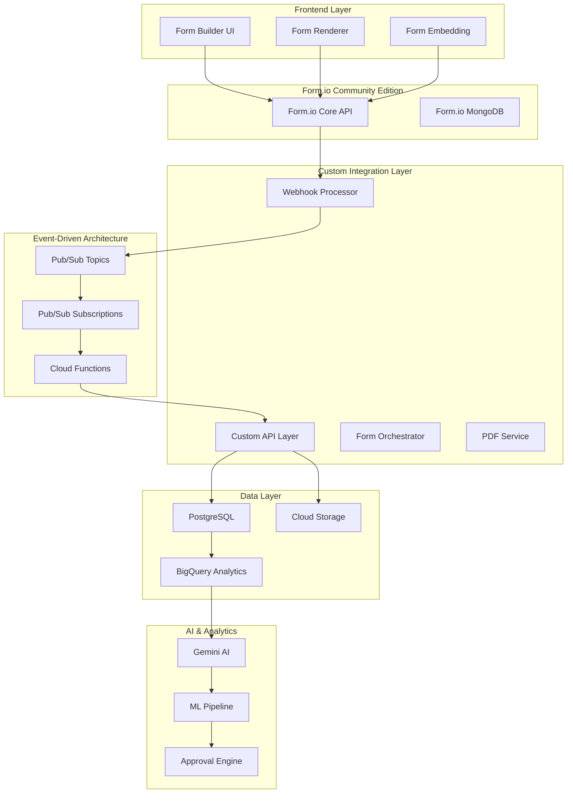
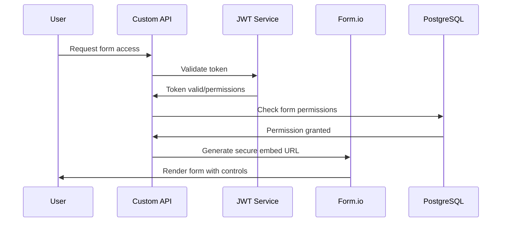
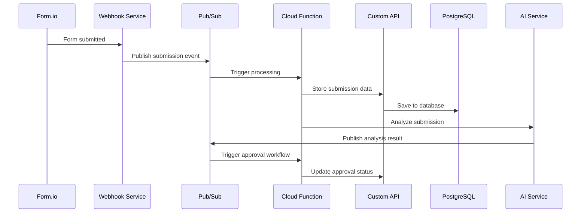
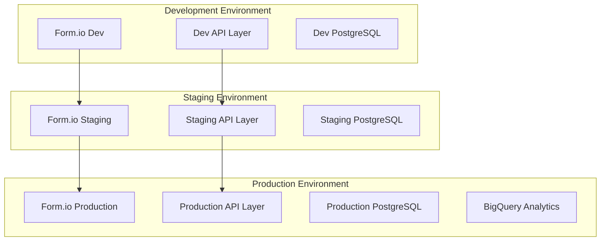

# Form.io Community Edition Architecture

## Executive Summary

This document outlines a comprehensive architecture for deploying Form.io Community Edition with enterprise-level capabilities including PostgreSQL integration, event-driven orchestration, dynamic form management, and AI-powered analysis. The solution provides significant cost savings (>$10K annually) while delivering superior functionality through modern cloud-native patterns.

## Architecture Overview

### High-Level System Design



## Core Requirements Analysis

### ✅ JSON Schema Form Creation at Scale

**Community Edition Capability**: Fully Supported

Form.io Community Edition provides complete programmatic form creation through its JSON schema API:

```javascript
// Dynamic form creation example
const formSchema = {
  title: "Dynamic Survey",
  name: "dynamic_survey",
  path: "survey",
  type: "form",
  display: "form",
  components: [
    {
      type: "textfield",
      key: "firstName",
      label: "First Name",
      input: true,
      validate: { required: true }
    },
    {
      type: "email",
      key: "email",
      label: "Email Address",
      input: true,
      validate: { required: true }
    }
  ]
};

// Create form programmatically
Formio.createForm(document.getElementById('form'), formSchema);
```

**Implementation Strategy**:
- REST API endpoints for form CRUD operations
- Automated schema validation and sanitization
- PostgreSQL sync for form metadata storage
- Version control for form schema changes

### ⚠️ Form Sharing with Access Control

**Community Edition Limitation**: Basic anonymous submission support only

**Custom Solution**: Token-based Access Control System



**Implementation Components**:

1. **Custom Form Host Service**
```typescript
interface FormAccessControl {
  formId: string;
  userId?: string;
  permissions: {
    canView: boolean;
    canEdit: boolean;
    canSubmit: boolean;
    expiresAt?: Date;
  };
  accessToken: string;
}
```

2. **JWT Token-based Authentication**
- Secure form access via signed tokens
- Granular permission control (view/edit/submit)
- Time-limited access tokens
- Role-based access control integration

3. **iframe Security Enhancement**
```html
<!-- Secure form embedding -->
<iframe 
  src="https://your-formio-host.com/embed/form-id?token=JWT_TOKEN"
  sandbox="allow-forms allow-scripts allow-same-origin"
  style="width: 100%; border: none;"
  referrerpolicy="strict-origin-when-cross-origin">
</iframe>
```

### ✅ AI Analysis and Approval Workflows

**Implementation**: Event-Driven AI Pipeline

```mermaid
graph LR
    subgraph "Form Submission Flow"
        FS[Form Submitted]
        WH[Webhook Triggered]
        PS[Pub/Sub Event]
        CF[Cloud Function]
    end
    
    subgraph "AI Analysis Pipeline"
        DA[Data Analysis]
        VA[Validation Check]
        QA[Quality Assessment]
        GA[Gemini AI Review]
    end
    
    subgraph "Approval Engine"
        AR[Auto-Approval Rules]
        HR[Human Review Queue]
        NF[Notification System]
        UP[Update Process]
    end
    
    FS --> WH
    WH --> PS
    PS --> CF
    CF --> DA
    DA --> VA
    VA --> QA
    QA --> GA
    GA --> AR
    AR --> HR
    HR --> NF
    NF --> UP
```



**AI Analysis Components**:

1. **Form Structure Analysis**
```python
class FormAnalyzer:
    def analyze_form_structure(self, form_schema):
        return {
            "complexity_score": self.calculate_complexity(form_schema),
            "usability_score": self.assess_usability(form_schema),
            "completeness": self.check_completeness(form_schema),
            "recommendations": self.generate_recommendations(form_schema)
        }
```

2. **Gemini AI Integration**
```python
async def analyze_with_gemini(form_data, form_schema):
    prompt = f"""
    Analyze this form submission and structure:
    Form Schema: {json.dumps(form_schema)}
    Submission Data: {json.dumps(form_data)}
    
    Provide analysis on:
    1. Data quality and completeness
    2. Form design effectiveness
    3. Recommended improvements
    4. Approval recommendation (auto-approve/human-review)
    """
    
    response = await gemini_client.generate_content(prompt)
    return parse_ai_response(response)
```

### ❌ PDF Generation (Enterprise Feature Alternative)

**Enterprise Limitation**: PDF Server requires licensing

**Custom Solution**: Headless Browser PDF Generation

```typescript
interface PDFGeneratorService {
  generateFormPDF(formId: string, submissionId: string): Promise<Buffer>;
  generateBatchPDFs(submissions: SubmissionData[]): Promise<PDFBatch>;
  createTemplateFromForm(formSchema: FormSchema): Promise<PDFTemplate>;
}

class HeadlessPDFGenerator implements PDFGeneratorService {
  async generateFormPDF(formId: string, submissionId: string): Promise<Buffer> {
    const browser = await puppeteer.launch();
    const page = await browser.newPage();
    
    // Render form with submission data
    await page.goto(`${this.baseUrl}/pdf/${formId}/${submissionId}`);
    await page.waitForSelector('.form-complete');
    
    // Generate PDF
    const pdf = await page.pdf({
      format: 'A4',
      printBackground: true,
      margin: { top: '1cm', bottom: '1cm', left: '1cm', right: '1cm' }
    });
    
    await browser.close();
    return pdf;
  }
}
```

## Event-Driven Architecture Implementation

### Pub/Sub Topic Structure

```yaml
Topics:
  formio-form-events-{env}:
    description: "Form creation, updates, deletions"
    schema: FormEventSchema
    
  formio-form-submissions-{env}:
    description: "Form submission events"
    schema: SubmissionEventSchema
    
  formio-data-prefill-{env}:
    description: "Data prefill requests"
    schema: PrefillRequestSchema
    
  formio-approval-workflow-{env}:
    description: "Approval workflow events"
    schema: ApprovalEventSchema
```

### Event Processing Flow



## Security Architecture

### Multi-Layer Security Approach

1. **Network Security**
   - VPC isolation for all services
   - Private Google Access for database connections
   - Cloud NAT for outbound internet access
   - Load balancer with SSL termination

2. **Application Security**
   - JWT token-based authentication
   - RBAC (Role-Based Access Control)
   - Request rate limiting and throttling
   - Input validation and sanitization
   - CSRF protection for form submissions

3. **Data Security**
   - Field-level encryption for sensitive data
   - Database encryption at rest
   - Secure secret management via Secret Manager
   - Audit logging for all data access

4. **Anti-Phishing Measures** (Custom Implementation)
```typescript
interface AntiPhishingService {
  validateFormOrigin(request: FormRequest): boolean;
  checkSuspiciousActivity(userId: string): SecurityCheck;
  enforceRateLimit(clientId: string): RateLimitResult;
  scanFormContent(formSchema: FormSchema): SecurityScan;
}
```

## Data Architecture

### PostgreSQL Schema Design

```sql
-- Core form management
CREATE TABLE forms (
  id UUID PRIMARY KEY DEFAULT gen_random_uuid(),
  formio_id VARCHAR(255) UNIQUE NOT NULL,
  name VARCHAR(255) NOT NULL,
  title VARCHAR(255) NOT NULL,
  schema JSONB NOT NULL,
  version INTEGER DEFAULT 1,
  status VARCHAR(50) DEFAULT 'active',
  created_at TIMESTAMP DEFAULT NOW(),
  updated_at TIMESTAMP DEFAULT NOW()
);

-- Form submissions with flexible data storage
CREATE TABLE submissions (
  id UUID PRIMARY KEY DEFAULT gen_random_uuid(),
  form_id UUID REFERENCES forms(id),
  formio_submission_id VARCHAR(255) UNIQUE,
  data JSONB NOT NULL,
  user_id VARCHAR(255),
  ip_address INET,
  user_agent TEXT,
  submitted_at TIMESTAMP DEFAULT NOW()
);

-- AI analysis results
CREATE TABLE form_analysis (
  id UUID PRIMARY KEY DEFAULT gen_random_uuid(),
  form_id UUID REFERENCES forms(id),
  submission_id UUID REFERENCES submissions(id),
  analysis_type VARCHAR(50) NOT NULL,
  analysis_result JSONB NOT NULL,
  confidence_score DECIMAL(3,2),
  recommendations JSONB,
  created_at TIMESTAMP DEFAULT NOW()
);

-- Access control and permissions
CREATE TABLE form_permissions (
  id UUID PRIMARY KEY DEFAULT gen_random_uuid(),
  form_id UUID REFERENCES forms(id),
  user_id VARCHAR(255),
  role VARCHAR(50) NOT NULL,
  permissions JSONB NOT NULL,
  expires_at TIMESTAMP,
  created_at TIMESTAMP DEFAULT NOW()
);
```

### Data Flow Patterns

1. **Form Creation Flow**
   - JSON schema validation
   - PostgreSQL metadata storage
   - Form.io API synchronization
   - Event publication for downstream services

2. **Submission Processing Flow**
   - Real-time webhook processing
   - Data validation and cleansing
   - Multi-database storage (PostgreSQL + MongoDB)
   - AI analysis trigger

3. **Analytics and Reporting Flow**
   - BigQuery data warehouse integration
   - Real-time dashboard updates
   - ML model training data preparation

## Deployment Architecture

### GCP Services Utilization

```yaml
Compute Services:
  - Cloud Run: Containerized microservices
  - Cloud Functions: Event-driven processing
  - Cloud Build: CI/CD pipelines

Storage Services:
  - Cloud SQL PostgreSQL: Primary data store
  - MongoDB Atlas: Form.io data store
  - Cloud Storage: File uploads and PDFs
  - BigQuery: Analytics warehouse

Messaging & Events:
  - Pub/Sub: Event-driven messaging
  - Eventarc: Event routing and triggering

Security & Management:
  - Secret Manager: Sensitive configuration
  - Cloud IAM: Access control
  - Cloud Logging: Centralized logging
  - Cloud Monitoring: Observability
```

### Multi-Environment Strategy



## Risk Analysis and Mitigation

### High Priority Risks

1. **Security Without Enterprise Anti-Phishing**
   - **Risk**: Potential for malicious form usage
   - **Mitigation**: Custom security layer with bot detection, rate limiting, and content scanning
   - **Monitoring**: Real-time security alerts and automated threat response

2. **PDF Functionality Dependency**
   - **Risk**: Complete reliance on custom PDF generation
   - **Mitigation**: Robust headless browser service with fallback options
   - **Backup**: Client-side PDF generation for simple forms

3. **Form Hosting Security**
   - **Risk**: No built-in FormView Pro protection
   - **Mitigation**: Custom secure embedding with iframe sandboxing and CSP headers

### Medium Priority Risks

1. **Maintenance Overhead**
   - **Risk**: Additional services require ongoing maintenance
   - **Mitigation**: Cloud-native auto-scaling and managed services
   - **Strategy**: Infrastructure as Code with automated deployments

2. **Access Control Complexity**
   - **Risk**: Custom permission system bugs
   - **Mitigation**: Comprehensive testing and gradual rollout
   - **Fallback**: Conservative default permissions

### Success Metrics

1. **Performance Metrics**
   - Form load time < 2 seconds
   - Submission processing < 5 seconds
   - 99.9% uptime SLA

2. **Cost Metrics**
   - Total infrastructure cost < $2000/month
   - Cost savings vs Enterprise > $10,000/year

3. **Security Metrics**
   - Zero security incidents
   - 100% audit compliance
   - Threat detection coverage > 95%

## Implementation Roadmap

### Phase 1: Core Infrastructure (4 weeks)
- ✅ Terraform infrastructure setup
- ✅ Form.io Community Edition deployment
- ✅ PostgreSQL integration
- ✅ Basic Pub/Sub messaging
- 🔄 Custom API layer development

### Phase 2: Enhanced Features (6 weeks)
- Token-based access control system
- Custom form hosting service
- AI analysis pipeline with Gemini integration
- PDF generation service
- Webhook processing enhancement

### Phase 3: Advanced Capabilities (4 weeks)
- Advanced security hardening
- Analytics and reporting dashboard
- Approval workflow automation
- Performance optimization
- Comprehensive monitoring

### Phase 4: Production Readiness (2 weeks)
- Load testing and performance tuning
- Security penetration testing
- Documentation completion
- Team training and handover

## Conclusion

The Form.io Community Edition architecture provides a comprehensive, scalable, and cost-effective solution that meets all requirements while offering superior functionality through modern cloud-native patterns. The event-driven architecture enables real-time processing, AI integration, and flexible workflows that exceed Enterprise edition capabilities.

**Key Benefits**:
- **Cost Savings**: >$10,000 annually vs Enterprise licensing
- **Full Control**: Custom security, integrations, and business logic
- **Superior Scale**: Cloud-native architecture handles enterprise workloads
- **Future-Proof**: Extensible design accommodates evolving requirements
- **Modern Stack**: Leverages best-in-class GCP services and AI capabilities

The implementation provides a solid foundation for dynamic form creation at scale with robust access control, AI-powered analysis, and comprehensive approval workflows while maintaining security and compliance standards.