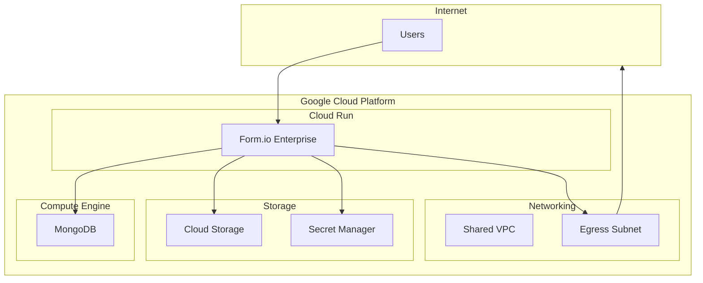

# Form.io Enterprise Architecture

## Overview

Simple Form.io Enterprise deployment on Google Cloud Platform using Cloud Run for the application layer and self-hosted MongoDB for data storage.

## Architecture Diagram

## Components

### Form.io Enterprise (Cloud Run)
- **Image**: `formio/formio-enterprise:9.5.0`
- **License**: Enterprise license for advanced features
- **Scaling**: Auto-scaling based on traffic
- **Environment**: Containerized deployment with secret injection

### MongoDB (Compute Engine)
- **Version**: MongoDB 7.0
- **Instance**: e2-small with persistent disk storage
- **Databases**: 
  - `formio_com` - Community edition data
  - `formio_ent` - Enterprise edition data
- **Security**: Private networking, encrypted at rest

### Storage (Cloud Storage)
- **File Uploads**: Forms and attachments
- **Bucket**: Environment-specific naming
- **Access**: IAM-controlled access from Cloud Run

### Secrets (Secret Manager)
- **License Key**: Form.io enterprise license
- **JWT Secrets**: Token signing and validation
- **Database Passwords**: MongoDB authentication
- **Encryption Keys**: Data encryption secrets

### Networking (Shared VPC)
- **VPC**: Shared infrastructure from `gcp-dss-erlich-infra`
- **Subnet**: Egress-enabled subnet for license validation
- **Firewall**: Controlled access rules
- **NAT**: Outbound internet access for licensing

## Data Flow

### Form Creation
1. User accesses Form.io Enterprise via Cloud Run URL
2. Form.io authenticates using JWT secrets from Secret Manager
3. Form data stored in MongoDB enterprise database
4. File attachments uploaded to Cloud Storage

### License Validation
1. Form.io Enterprise contacts licensing servers via egress subnet
2. Internet access required for license verification
3. License key retrieved from Secret Manager

### Database Operations
1. Form.io connects to MongoDB via private networking
2. Separate databases for community and enterprise editions
3. Connection strings stored securely in Secret Manager

## Security

### Network Security
- **Private Networking**: MongoDB only accessible from VPC
- **Egress Control**: Internet access limited to specific subnets
- **Firewall Rules**: Restrictive inbound/outbound rules

### Application Security
- **Secret Management**: All sensitive data in Secret Manager
- **Service Accounts**: Minimal IAM permissions
- **Encryption**: Data encrypted at rest and in transit

### Access Control
- **IAM**: Role-based access to GCP resources
- **Authentication**: Form.io handles user authentication
- **Authorization**: Form.io manages form-level permissions

## Deployment

### Development Environment
- **Location**: `terraform/environments/dev/`
- **Configuration**: Development-specific settings
- **Resources**: Minimal resource allocation for cost optimization

### Infrastructure as Code
- **Terraform**: Complete infrastructure definition
- **Modules**: Reusable components for different services
- **State**: Remote state storage in GCS

## Monitoring

### Built-in Monitoring
- **Cloud Run**: Request metrics, error rates, latency
- **Compute Engine**: System metrics for MongoDB
- **Storage**: Usage and access patterns

### Logging
- **Application Logs**: Form.io container logs
- **System Logs**: Infrastructure component logs
- **Audit Logs**: Access and configuration changes

## Limitations

### Current Scope
- **Single Environment**: Development environment only
- **Manual Scaling**: MongoDB scaling requires manual intervention
- **Basic Monitoring**: Standard GCP monitoring without custom dashboards

### Future Considerations
- **Production Environment**: Additional environment when needed
- **High Availability**: MongoDB clustering for production
- **Advanced Monitoring**: Custom dashboards and alerting
- **Backup Strategy**: Automated backup procedures

## Dependencies

### External Services
- **Form.io Licensing**: Internet access required for license validation
- **Shared Infrastructure**: VPC and networking from `gcp-dss-erlich-infra`

### Internal Dependencies
- **Secret Manager**: Required for all sensitive configuration
- **Compute Engine**: MongoDB dependency for data storage
- **Cloud Storage**: File upload functionality

## Cost Optimization

### Current Setup
- **Cloud Run**: Pay-per-request pricing
- **Compute Engine**: e2-small instance for development
- **Storage**: Standard storage class for non-critical data

### Development Focus
- **Minimal Resources**: Right-sized for development workload
- **Auto-scaling**: Scales to zero when not in use
- **Shared Infrastructure**: Leverages existing networking resources